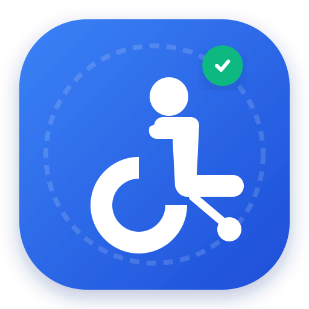

# WheeLife (車いすアクセシブルマップ)

現在地から車いすで利用可能な「ご飯屋さん（飲食店）」「遊ぶ場所（レジャー施設）」「多機能トイレ」を直感的に探せるモバイルファーストのWebアプリ/PWAです。



---

## 🌟 主な機能

1. **リアルタイム現在地探索**
   - GPS（Geolocation API）を利用し、ワンタップで現在地周辺のバリアフリースポットを自動検索・距離順ソート。
2. **3大カテゴリのクイック切り替え**
   - 🍽️ **ご飯・カフェ**: 段差なし・スロープ対応、車いす着席可能スペースのある飲食店。
   - 🎮 **遊ぶ場所**: バリアフリールート完備の映画館、美術館、公園、レジャー施設。
   - 🚻 **多機能トイレ**: だれでもトイレ、オストメイト、車いす対応個室。
3. **OpenStreetMap (Overpass API) 連携**
   - 世界中の地図オープンデータから `wheelchair=yes` や車いすトイレ属性をリアルタイム取得（APIキー不要）。
   - 代表的なバリアフリースポットもシードデータとして内蔵しているため、オフラインやテスト時も即座に利用可能。
4. **モバイル最適化ボトムシート & 詳細モーダル**
   - スマホ下部から引き上げて周辺スポットを一覧閲覧（タップで地図フォーカス）。
   - 詳細モーダルで「段差なし/スロープ」「エレベーター」「多機能トイレ」「オストメイト」などの設備状況を一目で確認。
   - **Googleマップ ルート案内リンク**: ワンタップでナビゲーション開始。
5. **PWA（Progressive Web App）対応**
   - Service Worker と Web App Manifest を完備。
   - スマートフォンのSafariやChromeで「ホーム画面に追加」するだけで、ネイティブアプリのように全画面で起動可能。

---

## 🚀 起動方法

### ローカルサーバーでの実行
本フォルダ（`wheelchair-map-app`）内で、Pythonの簡易HTTPサーバーを起動します。

```bash
# ターミナルまたはPowerShellで実行
python -m http.server 8080
```

ブラウザで以下のURLを開きます：
👉 **http://localhost:8080**

※ Chrome/Edgeの「デベロッパーツール」の「デバイスモード（スマホ表示）」で操作すると、よりリアルなモバイルアプリ体験を確認できます。

---

## 📁 ディレクトリ構成

```text
wheelchair-map-app/
├── index.html          # モバイルUI（ヘッダー、検索、地図、ボトムシート、詳細モーダル）
├── manifest.json       # PWA設定
├── sw.js               # Service Worker（オフラインキャッシュ対応）
├── css/
│   └── style.css       # ボトムシートアニメーション、タッチ操作最適化
├── js/
│   ├── app.js          # メインアプリ状態管理・イベント処理
│   ├── map.js          # Leaflet地図操作・カスタムピン描画
│   ├── osmService.js   # OpenStreetMap Overpass API 連携
│   └── data.js         # シードデータ & 距離計算ユーティリティ
└── icons/
    ├── icon.svg        # 高解像度ベクターアプリアイコン
    ├── icon-192.png    # PWA用アイコン (192x192)
    └── icon-512.png    # PWA用アイコン (512x512)
```
